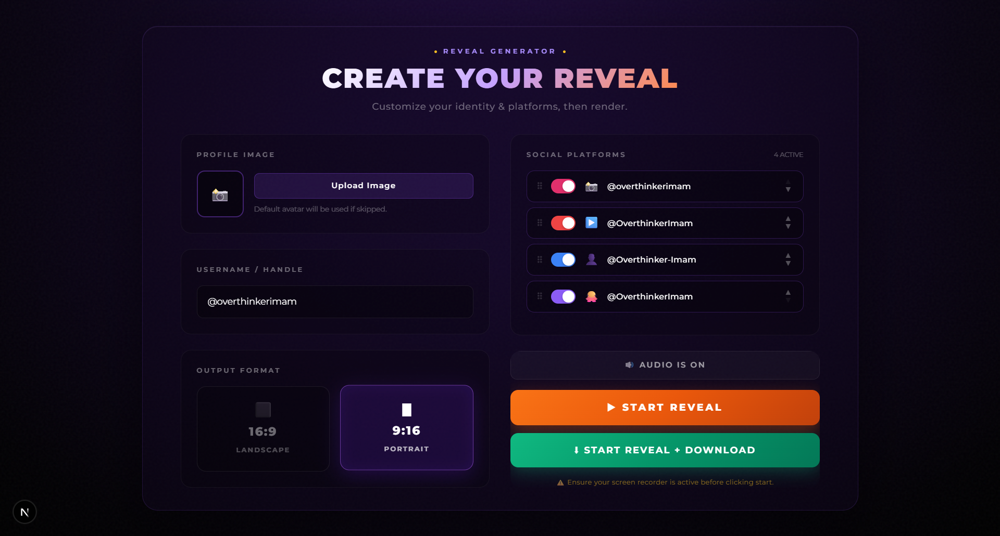
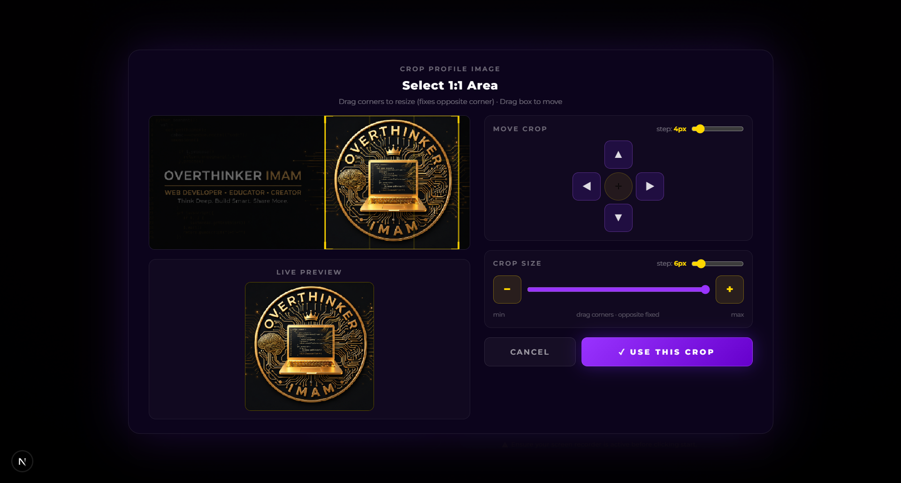
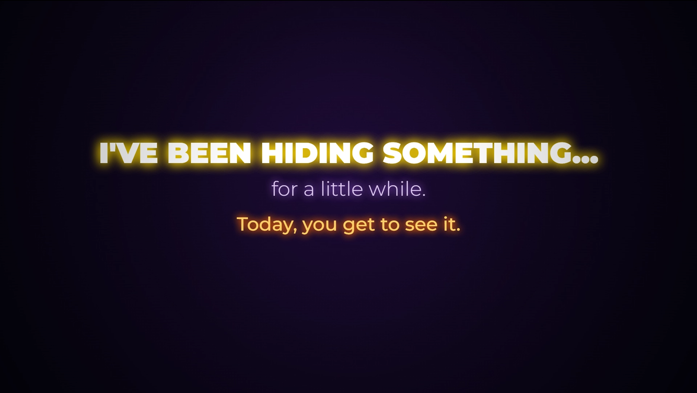
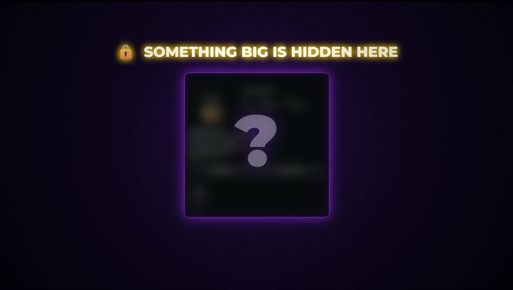
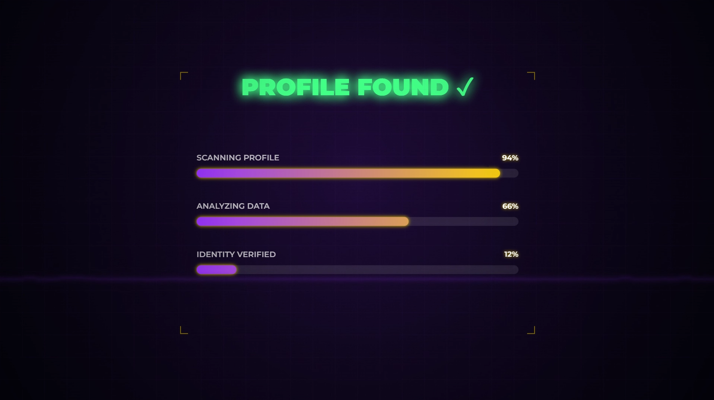
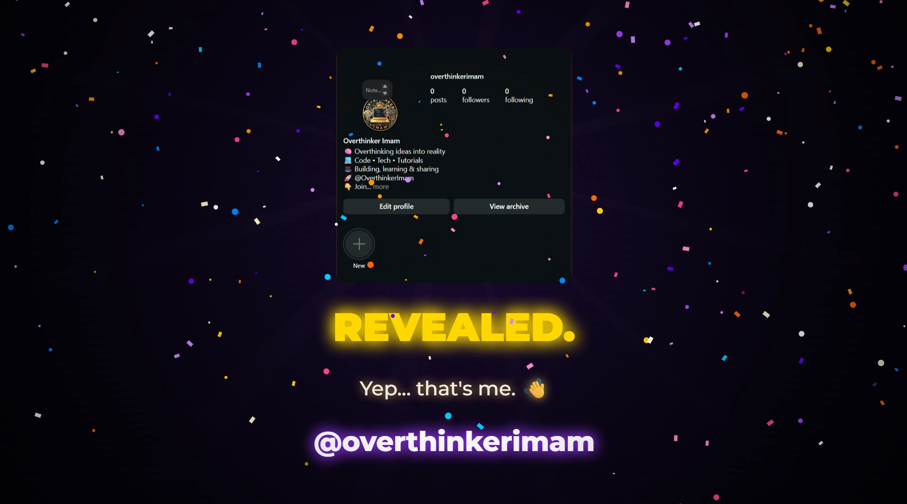
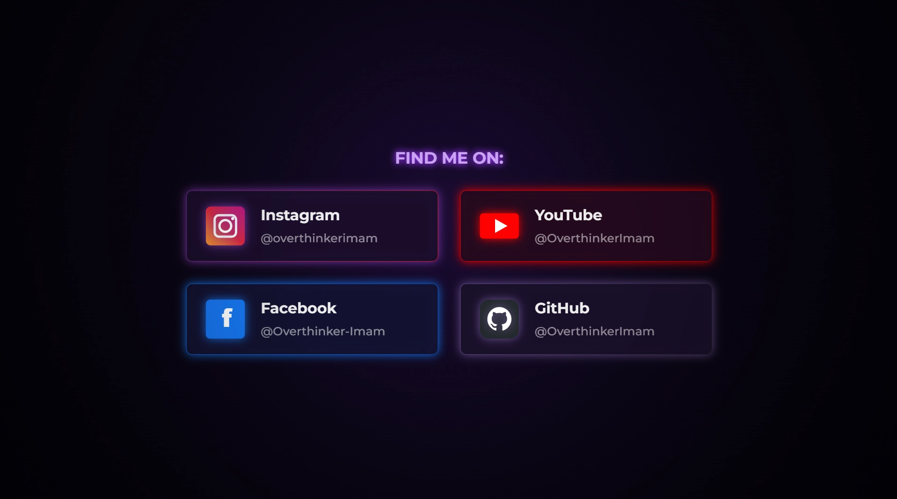
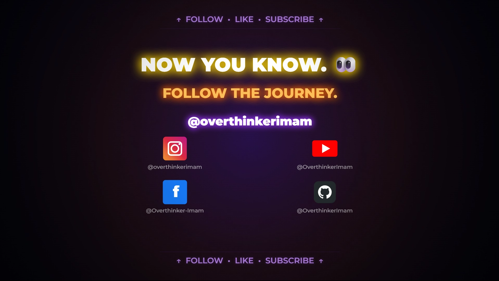
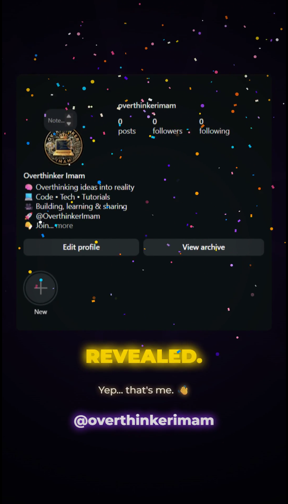

# 🎬 Cinematic Social Media Reveal Generator

> Generate stunning, cinematic social media reveal videos entirely in your browser. Customize your profile, pick your platforms, and export animated intros as WebM — complete with particle effects, countdown sequences, light rays, and audio sync.

<p align="center">
  
  
  
  
  
</p>

<p align="center">
  <a href="https://cinematic-social-media-reveal-gener.vercel.app" target="_blank">
    
  </a>
</p>

---

## 🌐 Live Demo

Try the live generator in your browser:  
👉 **[cinematic-social-media-reveal-gener.vercel.app](https://cinematic-social-media-reveal-gener.vercel.app)**

---

## 📸 Screenshots

### 🎛️ Control Panel Dashboard
*Upload your image, crop it, configure handles, arrange social platforms via drag-and-drop, and switch aspect ratios instantly.*


### ✂️ Image Cropper
*Built-in profile image upload and crop tool — square crop with live preview before the reveal starts.*



### 1. ✨ Intro Phase
*Dramatic text fade-in that sets the mystery and hooks the viewer from the first second.*



### 2. 🔒 Suspense Phase
*Blurred mystery card with pulsing purple glow — building anticipation before the reveal.*



### 3. 📡 Scan Phase
*HUD-style profile scanning with animated gradient progress bars and corner brackets.*



### 4. 🎬 The Reveal Moment
*The climax — profile sharpens with confetti bursts, light rays, and the iconic REVEALED. text.*



### 5. 🃏 Social Cards
*Staggered platform cards with official icons, custom handles, and neon border glows.*



### 6. 📣 Final Call-To-Action
*Smart multi-row icon grid (adapts for 1–4 platforms) with FOLLOW · LIKE · SUBSCRIBE banners.*



### 📱 Mobile Portrait Format (9:16 Shorts & Reels)
*Fully responsive portrait rendering optimized for TikTok, Instagram Reels, and YouTube Shorts.*
<p align="center">
  
</p>

---

## ✨ Features

### 🎛️ Control Panel
- **Profile Image Upload** — Upload and crop your profile picture with a built-in image cropper
- **Username Customization** — Set your display handle that appears in the reveal
- **Platform Selection** — Enable/disable and reorder social platforms via drag-and-drop
  - 📸 Instagram
  - ▶️ YouTube
  - 👤 Facebook
  - 🐙 GitHub
- **Aspect Ratio** — Choose between **16:9** (Landscape — YouTube, Facebook) or **9:16** (Portrait — Reels, Shorts, TikTok)
- **Audio Toggle** — Mute or unmute the background soundtrack
- **One-Click Export** — Start the animation with optional auto-download

### 🎞️ Cinematic Animation (34 seconds)
The reveal plays through **8 distinct phases**, each with unique visuals:

| Phase | Time | Description |
|-------|------|-------------|
| **Intro** | 0–4s | Dramatic text fade-in: *"I've been hiding something..."* |
| **Suspense** | 4–9s | Blurred profile card with pulsing glow and mystery text |
| **Scan** | 9–13s | HUD-style scanning with animated progress bars |
| **Countdown** | 13–19s | 3-2-1 countdown with color-coded bursts and particles |
| **Reveal** | 19–21s | Flash transition, blur-to-sharp profile image with light rays |
| **That's Me** | 21–24s | Username reveal with spring-animated layout |
| **Social Cards** | 24–28s | Staggered platform cards with icons and handles |
| **Final CTA** | 28–34s | Call-to-action with smart icon grid layout |

### 🎨 Visual Effects
- **Particle System** — Floating particles, burst explosions, and confetti
- **Light Rays** — Dynamic radial light beams during the reveal
- **Vignette** — Cinematic edge darkening
- **Spring Physics** — Smooth, natural layout transitions
- **Glow & Shadow** — Per-element neon glow effects
- **Progress Bars** — Animated gradient scan bars with percentage counters

### 📹 Recording & Export
- **WebM Recording** — Captures the canvas at 60fps with VP9/VP8 codec
- **Audio Embedding** — Mixes the background soundtrack into the video
- **Auto-Download** — Optional one-click record + download
- **Seekable Output** — Post-processes the WebM file for proper seeking
- **Thumbnail Generation** — Renders a blurred preview frame before recording starts

### 🧠 Smart Icon Layout (Final CTA)
The final scene automatically adapts the icon grid based on active platform count:

| Platforms | Layout |
|-----------|--------|
| 1 | Single large icon, centered |
| 2 | Two large icons side-by-side |
| 3 | Row 1: 1 large icon · Row 2: 2 medium icons |
| 4 | 2×2 grid of medium icons |

---

## 🚀 Getting Started

### Prerequisites
- **Node.js** 18+ ([Download](https://nodejs.org/))
- **npm**, **yarn**, or **pnpm**

### Installation

# Clone the repository
git clone https://github.com/OverthinkerImam/cinematic-social-media-reveal-generator.git

# Navigate into the project
cd cinematic-social-media-reveal-generator

# Install dependencies
npm install

### Development

```bash
npm run dev
```

Open [http://localhost:3000](http://localhost:3000) in your browser.

### Production Build

```bash
npm run build
npm start
```

---

## 📁 Project Structure
<pre>
cinematic-social-media-reveal-generator
├── LICENSE
├── README.md
├── eslint.config.mjs
├── next.config.ts
├── package.json
├── postcss.config.mjs
├── public
│   ├── audio
│   │   └── intro.mp3                   # Background soundtrack for the reveal video
│   ├── file.svg
│   ├── globe.svg
│   ├── images
│   │   └── profile.png                 # Fallback mystery profile image (used if no custom upload)
│   ├── next.svg
│   ├── vercel.svg
│   └── window.svg
├── src
│   ├── app
│   │   ├── favicon.ico
│   │   ├── globals.css                 # Global Tailwind/CSS rules & responsive layouts
│   │   ├── layout.tsx                  # Root HTML boilerplate with Montserrat font loading
│   │   └── page.tsx                    # Next.js page routing entry point
│   ├── components
│   │   ├── App.tsx                     # Main application state, phase, and configuration manager
│   │   ├── ControlPanel.tsx            # Setup dashboard for usernames, formats, and toggle options
│   │   ├── ImageCropper.tsx            # Built-in cropper utility for custom profile picture uploads
│   │   ├── PlatformConfigurator.tsx    # Interactive drag-and-drop platform list with custom inputs
│   │   └── RevealCanvas.tsx            # High-performance animation coordinator and WebM recorder
│   ├── config
│   │   └── index.ts                    # App timeline constants, audio sources, and platform link configurations
│   ├── types
│   │   ├── index.ts                    # TypeScript global type wrappers and type safety limits
│   │   └── particles.ts                # Particle emitter definitions (Floating, Burst, and Confetti)
│   └── utils
│       ├── audioManager.ts             # Multi-browser audio synchronization and audio node output mixing
│       ├── canvasDraw.ts               # Physics-based visual rendering pipeline for all 8 scene phases
│       └── webmFix.ts                  # Custom injector resolving non-seekable WebM video file properties
└── tsconfig.json
</pre>
---

## ⚙️ Configuration

Edit `src/config/index.ts` to customize defaults:

```typescript
export const CONFIG = {
  profileImage: '/images/profile.png',
  username: '@overthinkerimam',

  instagramUrl: 'https://instagram.com/overthinkerimam',
  youtubeUrl: 'https://youtube.com/@OverthinkerImam',
  facebookUrl: 'https://www.facebook.com/profile.php?id=61593412310090',
  githubUrl: 'https://github.com/OverthinkerImam',

  instagramHandle: '@overthinkerimam',
  youtubeHandle: '@OverthinkerImam',
  facebookHandle: '@Overthinker-Imam',
  githubHandle: '@OverthinkerImam',

  revealDuration: 10,
  postRevealDuration: 8,

  timeline: {
    introStart: 0,
    introEnd: 4,
    suspenseStart: 4,
    suspenseEnd: 9,
    scanStart: 9,
    scanEnd: 13,
    countdownStart: 13,
    countdownEnd: 19,
    revealAt: 19,
    revealAnimEnd: 21,
    thatsMeStart: 21,
    thatsMeEnd: 24,
    socialCardsStart: 24,
    socialCardsEnd: 28,
    finalCtaStart: 28,
    finalCtaEnd: 34,
  },

  audio: {
    intro: '/audio/intro.mp3',
  },
};

export type Config = typeof CONFIG;
```

---

## 🎨 Customization

### Adding a New Platform

1. **Add the type** in `src/types/index.ts`:
   ```typescript
   name: 'instagram' | 'youtube' | 'facebook' | 'github' | 'twitter';
   ```

2. **Add config** in `src/config/index.ts`:
   ```typescript
   twitterUrl: 'https://twitter.com/yourhandle',
   twitterHandle: '@yourhandle',
   ```

3. **Add to defaults** in `App.tsx` and `ControlPanel.tsx`:
   ```typescript
   { id: 'twitter', name: 'twitter', handle: CONFIG.twitterHandle, enabled: true, order: 4 },
   ```

4. **Add platform meta** in `PlatformConfigurator.tsx`:
   ```typescript
   twitter: { label: 'Twitter', icon: '🐦', placeholder: '@yourhandle', color: '#1da1f2' },
   ```

5. **Add icon & info** in `canvasDraw.ts`:
   - Create a `drawTwitterIcon()` function
   - Add to `PLATFORM_INFO` and `getIconFn()`

### Changing the Timeline

Adjust any value in `CONFIG.timeline`. All drawing functions reference these timestamps dynamically, so the animation will adapt automatically.

### Changing Colors

Key color constants are defined at the top of `src/utils/canvasDraw.ts`:
```typescript
const GOLD = '#ffd700';
const PURPLE = '#9933ff';
const ORANGE = '#ff6600';
```

---

## 🛠️ Tech Stack

| Technology | Purpose |
|------------|---------|
| **Next.js 16** | React framework with App Router |
| **TypeScript** | Type-safe development |
| **React 19** | UI components & state management |
| **HTML5 Canvas API** | Real-time 2D animation rendering |
| **MediaRecorder API** | Browser-native video capture |
| **Web Audio API** | Audio playback & stream mixing |
| **Path2D** | Vector icon rendering (GitHub logo) |
| **CSS Animations** | UI transitions & effects |

---

## 🌐 Browser Compatibility

| Browser | Support |
|---------|---------|
| Chrome / Edge | ✅ Full support |
| Firefox | ✅ Full support |
| Safari | ⚠️ Partial (WebM export may vary) |

> **Note:** The `canvas.captureStream()` API is required for video recording. All modern Chromium-based browsers support this fully.

---

## 📸 Screenshots

| Control Panel | Animation Preview |
|---------------|-------------------|
| *Upload image, set username, pick platforms* | *Cinematic 34-second reveal sequence* |
| 16:9 or 9:16 format selection | Particle effects & light rays |
| Drag-and-drop platform reorder | Auto WebM export |

---

## 🤝 Contributing

Contributions are welcome! Feel free to:

1. **Fork** the repository
2. Create a **feature branch** (`git checkout -b feature/amazing-feature`)
3. **Commit** your changes (`git commit -m 'Add amazing feature'`)
4. **Push** to the branch (`git push origin feature/amazing-feature`)
5. Open a **Pull Request**

---

## 📄 License

This project is licensed under the **MIT License** — see the [LICENSE](LICENSE) file for details.

---

## 👤 Author

**OverthinkerImam**
- GitHub: [@OverthinkerImam](https://github.com/OverthinkerImam)
- Instagram: [@overthinkerimam](https://instagram.com/overthinkerimam)
- YouTube: [@OverthinkerImam](https://youtube.com/@OverthinkerImam)

---

## ⭐ Show Your Support

If you found this project useful, please consider giving it a **star** on GitHub!

---

*Built with ❤️ using Next.js, TypeScript & the HTML5 Canvas API.*
